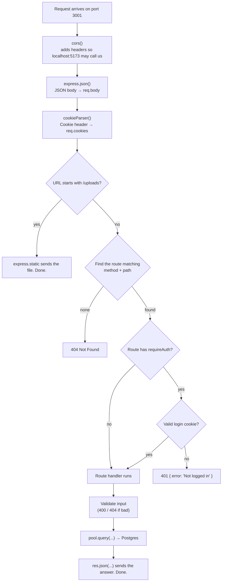

# How `server/index.mjs` works: the flow, step by step

A beginner's guide to **what happens, in what order**, inside the API
server. It doesn't go line by line. It answers three questions:

1. What runs when the server **starts**?
2. What happens when a **request arrives**?
3. How do the three most important kinds of request (public read, login,
   admin save) travel from the browser to the database and back?

Read [`BACKEND_SETUP.md`](./BACKEND_SETUP.md) first if words like
"Postgres", "API" or "JWT" are new. For a map of the file, see
[`scripts/server.md`](./scripts/server.md). Keep
`server/index.mjs` and `db/schema.sql` open next to this doc while you read.

## The one idea that makes the file make sense

The file is read **once, top to bottom**, when you run `npm run server`.
But most of the code is not *run* at that moment. It is only **registered**.

```js
app.get('/api/teams', async (req, res) => { ... });
```

This line does **not** fetch teams. It tells Express: *"later, whenever
someone asks for `GET /api/teams`, run this function."* The function body
runs zero times at startup, and once for every matching request afterwards.

So the file has two phases:

| Phase | When | What runs |
| --- | --- | --- |
| **Startup** | Once, when the process starts | Imports, settings, folder creation, registering middleware and routes, then `app.listen(...)` |
| **Requests** | Every time a browser calls the API, forever, until you stop the server | Only the middleware and the one route handler that match that request |

A useful way to picture it: startup builds a restaurant (kitchen, menu,
staff). Requests are customers coming in. The menu is written once; the
cooking happens per order.

## Phase 1: startup, in order

When you type `npm run server` locally (or pm2 starts it on the droplet),
Node runs these steps in order:

1. **Imports (lines 1–13).** Loads the libraries, plus three of the
   project's own files:
   - `pool` from `scripts/db.mjs`: the database connection pool. Importing
     it also runs `dotenv.config()`, which reads `.env`, so `DATABASE_URL`
     and `JWT_SECRET` become available as `process.env.*`.
   - `buildStandings`, `buildBracket`, `buildPlayerStats` from `src/utils/`:
     the same calculation code the Vue app uses.
2. **Create the app (line 15).** `const app = express()` makes an empty
   server with no routes yet.
3. **Register global middleware (lines 18–20).** These run on *every*
   request, in this order (see Phase 2).
4. **Prepare the uploads folder (lines 27–32).** Creates
   `uploads/player-photos/` and `uploads/featured-photos/` if they're
   missing, and serves anything inside at `/uploads/...`.
5. **Configure multer (lines 34–38).** Settings for photo uploads: keep the
   file in memory, max 5 MB, only JPG/PNG/WebP. Nothing is uploaded yet.
6. **Define `requireAuth` (lines 43–52).** Just a function definition. It
   runs later, per request.
7. **Register every route (lines 54–596).** Each `app.get/post/put/delete`
   adds one entry to Express's list of routes. Helper functions like
   `slugify` and `generatePlayerId` are also defined here, to be called
   later by those routes.
8. **Start listening (lines 598–604).** `app.listen(3001, '127.0.0.1')`
   opens the port and prints `API server running at ...`. From here the
   process **stays alive** and waits. That's why the terminal doesn't
   return to a prompt.

> If startup crashes (missing package, syntax error, port 3001 already in
> use), step 8 never happens and **every** `/api` call fails. That's the
> "no server, no API" situation.

> Note: the database is **not** contacted at startup. `pg.Pool` connects
> lazily, on the first query. So a wrong `DATABASE_URL` doesn't stop the
> server from starting; it shows up as an error on the first request
> instead. `node scripts/test-db.mjs` checks the connection directly.

## Phase 2: what happens when a request arrives

Every request goes through the same pipeline. Express walks down the list
of things registered in Phase 1, **in the order they were registered**:



Things to notice:

- **Every step either passes the request on or answers it.** Middleware
  passes it on by calling `next()`. Anything that calls `res.json(...)` or
  `res.status(...).json(...)` ends the request. Nothing after that runs.
- **`requireAuth` is just another step in the chain.** In
  `app.post('/api/teams', requireAuth, async (req, res) => {...})`, Express
  runs `requireAuth` first; only if it calls `next()` does the handler run.
  Remove that word and the route is open to anyone.
- **`req` is filled in as it travels.** By the time your handler runs,
  `req.body` (from `express.json`), `req.cookies` (from `cookieParser`),
  `req.params` (from the `:gameId` part of the URL) and, on protected
  routes, `req.user` (from `requireAuth`) are all ready.
- **Errors don't crash the server.** This project uses Express 5: if an
  `async` handler throws (say, the database is down), Express catches it
  and answers `500 Internal Server Error`. The server keeps running for the
  next request.

### How the request reaches port 3001 at all

The server only listens on `127.0.0.1` (line 601), meaning "this machine
only". The browser never talks to it directly. Something in between
forwards `/api/...` to it:

| Where | Browser asks | Forwarded by | To |
| --- | --- | --- | --- |
| Local dev | `http://localhost:5173/api/teams` | Vite's proxy (`vite.config.js`) | `127.0.0.1:3001/api/teams` |
| Live site | `https://cgyballers.gacs.me/api/teams` | Nginx | `127.0.0.1:3001/api/teams` |

The server code is identical in both cases. It can't tell the difference.

## Three flows, traced end to end

### Flow 1: a public read (the Standings page)

No login, no writes. This is the shape of every `GET` route.

1. **Browser.** Someone opens `/standings`. `src/pages/Standings.vue` calls
   `cachedJson('/api/standings', [])` (`src/data/apiCache.js`), which runs
   `fetch('/api/standings')`.
2. **Proxy.** Vite or Nginx forwards it to port 3001.
3. **Middleware.** `cors`, `express.json`, `cookieParser` run. Nothing to
   do here; the request is passed on.
4. **Route match.** `app.get('/api/standings', ...)` (line 492). No
   `requireAuth`, so the handler runs straight away.
5. **Database.** `loadStandingsInputs()` (line 448) runs two queries: all
   teams, all games.
6. **Calculation.** `buildStandings(games, teams)` (in
   `src/utils/standings.js`) works out wins, losses and order in plain
   JavaScript. The standings are **not stored** in the database; they're
   recalculated on every request from the games.
7. **Response.** `res.json(...)` turns the array into JSON and sends it.
8. **Browser.** `apiCache.js` puts the JSON into a Vue `ref`, and the table
   re-renders.

`/api/playoffs` and `/api/player-stats` follow the same pattern: load raw
rows, compute in JavaScript, send the result.

### Flow 2: logging in

This is how the browser gets the "I'm an admin" cookie that every
protected route checks.

1. **Browser.** `src/pages/admin/Login.vue` sends
   `POST /api/login` with `{ username, password }` as JSON and
   `credentials: 'include'` (meaning "accept and store cookies").
2. **Middleware.** `express.json()` turns the body into `req.body`.
3. **Handler (line 54).**
   1. Looks up the user: `SELECT * FROM users WHERE username = $1`.
   2. `bcrypt.compare(password, user.password_hash)`. The database never
      stores the real password, only a one-way hash. bcrypt hashes what
      was typed and compares.
   3. Wrong user or wrong password → `401 Invalid username or password`.
      (The same message for both, on purpose, so attackers can't learn
      which usernames exist.)
   4. Correct → `jwt.sign(...)` creates a **token**: a small string saying
      "user 1, username X, expires in 7 days", signed with `JWT_SECRET`. If
      anyone edits the token, the signature no longer matches.
   5. `res.cookie(...)` tells the browser to store the token in the
      `cgyballers_session` cookie. `httpOnly` means page JavaScript can't
      read it; the browser just sends it back automatically.
4. **Browser.** `Login.vue` sees `res.ok` and redirects to `/admin`.

From now on, every request this browser sends to the API carries the
cookie. On a protected route, `requireAuth` (line 43):

1. reads `req.cookies.cgyballers_session` (missing → 401),
2. runs `jwt.verify(token, JWT_SECRET)` (forged or expired → 401),
3. puts the decoded `{ sub, username }` on `req.user` and calls `next()`.

Nothing about the login is stored on the server. The cookie itself is the
proof. That's why restarting the server doesn't log anyone out, but
changing `JWT_SECRET` logs **everyone** out.

`/api/logout` just deletes the cookie. `/api/me` is a protected route that
does nothing but return `req.user.username`; the admin pages call it on
load to ask "am I still logged in?".

### Flow 3: an admin save (entering a box score)

The most complete flow in the file: auth, validation, several queries and
a **transaction**.

1. **Browser.** `src/pages/admin/BoxScoreEntry.vue` sends
   `POST /api/games/g12/boxscore` with
   `{ lines: { "grit-bardos": { pts: 14, reb: 6, ... }, ... } }`.
   The login cookie rides along automatically.
2. **Middleware → route match** (line 545). `:gameId` in the path becomes
   `req.params.gameId = 'g12'`.
3. **`requireAuth`.** Valid cookie → `next()`.
4. **Handler, checks first:**
   1. Load the game's home and away team. Not found → `404`.
   2. Load both rosters and build `teamOf`, a lookup "player id → team id",
      used to add up each team's score.
5. **Handler, the transaction:**
   1. `pool.connect()` borrows **one** dedicated connection (`client`).
      A transaction must run on a single connection; `pool.query` could
      use a different connection each time.
   2. `BEGIN`: "hold all following changes until I say so."
   3. For each player: an **upsert** into `boxscore_lines`
      (`INSERT ... ON CONFLICT (game_id, player_id) DO UPDATE`). New line →
      inserted; existing line (re-editing a game) → overwritten. Their
      points are added to the home or away total.
   4. `UPDATE games SET status = 'final', home_score, away_score`.
   5. `COMMIT`: all changes become visible **at once**.
   6. If anything fails in between → `ROLLBACK`: **none** of the changes
      are kept, so you never end up with half a box score. Then `throw`
      lets Express answer 500.
   7. `finally { client.release() }` returns the connection to the pool,
      whether it succeeded or not. Forgetting this would slowly use up
      every connection.
6. **Response.** `{ homeScore, awayScore }`.
7. **Browser.** Redirects to `/admin`. The next visit to `/standings`
   recalculates from the updated games (Flow 1), so the standings update
   with no extra work.

## All routes at a glance

**Public** routes can be called by anyone (the website needs them).
**Login** routes go through `requireAuth` first.

| Method | Path | Access | What it does |
| --- | --- | --- | --- |
| POST | `/api/login` | Public | Check password, set the session cookie |
| POST | `/api/logout` | Public | Clear the session cookie |
| GET | `/api/me` | Login | "Am I logged in, and as whom?" |
| GET | `/api/teams` | Public | All teams, with their player ids |
| POST | `/api/teams` | Login | Create a team (id made from the name) |
| PUT | `/api/teams/:teamId` | Login | Edit a team |
| POST | `/api/teams/:teamId/featured-photo` | Login | Upload the matchup-card photo (640×640 WebP) |
| DELETE | `/api/teams/:teamId/featured-photo` | Login | Remove it (card falls back to the logo) |
| GET | `/api/players` | Public | All players, with their team name |
| POST | `/api/players` | Login | Create a player (id = `team-name`) |
| PUT | `/api/players/:playerId` | Login | Edit a player |
| POST | `/api/players/:playerId/photo` | Login | Upload a player photo (400×400 WebP) |
| DELETE | `/api/players/:playerId/photo` | Login | Remove it (falls back to initials) |
| GET | `/api/games` | Public | All games, plus whether each has a box score |
| POST | `/api/games` | Login | Add a game to the schedule (ids `g1`, `g2`, ...) |
| DELETE | `/api/games/:gameId` | Login | Delete a game (its box score goes too) |
| PUT | `/api/games/:gameId/status` | Login | Set final / forfeit / cancelled / scheduled by hand |
| GET | `/api/games/:gameId/boxscore` | Public | One game, both rosters, saved stat lines |
| POST | `/api/games/:gameId/boxscore` | Login | Save all stat lines, set the final score |
| GET | `/api/player-stats` | Public | Season averages, computed from box scores |
| GET | `/api/standings` | Public | Standings, computed from games |
| GET | `/api/playoffs` | Public | Playoff bracket, computed from standings + games |
| GET | `/sitemap.xml` | Public | List of pages for Google, built from the database |

The pattern: **reads are public, writes need login.** If you add a route
that changes data, give it `requireAuth`.

## Status codes you'll see

| Code | Meaning | Where it comes from here |
| --- | --- | --- |
| `200` | OK | Default when a handler calls `res.json(...)` |
| `201` | Created | `POST` routes that create a team, player or game |
| `204` | OK, nothing to send back | `DELETE /api/games/:gameId` |
| `400` | Your input is wrong | Missing name, unknown team, bad stage, file too big |
| `401` | Not logged in | `requireAuth`, or a wrong password at login |
| `404` | That thing doesn't exist | Unknown team/player/game id, or an unknown URL |
| `500` | The server broke | An uncaught error, e.g. the database is unreachable |

## Try it yourself

1. **Watch the two phases.** Add `console.log('startup')` near the top of
   the file and `console.log('request!')` inside the `/api/teams` handler.
   Restart the server: `startup` prints once. Open
   `http://localhost:3001/api/teams` a few times: `request!` prints each
   time.
2. **See `requireAuth` block you.** In a new private/incognito window (no
   cookie), open `http://localhost:3001/api/me`. You get
   `{"error":"Not logged in"}`. Log in to the admin in your normal window
   and open the same URL through the site (`http://localhost:5173/api/me`):
   you get your username.
3. **Write a route.** Add this above `app.listen`, restart, and open
   `http://localhost:3001/api/hello`:

   ```js
   app.get('/api/hello', async (req, res) => {
     const result = await pool.query('SELECT COUNT(*)::int AS teams FROM teams');
     res.json({ hello: 'world', teams: result.rows[0].teams });
   });
   ```

   That's a complete flow: route match → query → JSON response. Remove it
   when you're done.

Remember: the server doesn't reload by itself. After every edit, `Ctrl+C`
and `npm run server` again.

## See also

- [`BACKEND_SETUP.md`](./BACKEND_SETUP.md): why the backend exists, terms
  explained
- [`scripts/node-basics.md`](./scripts/node-basics.md): Node basics (`$1` placeholders, pool vs.
  client, upsert); the other scripts are in [`scripts/`](./scripts/README.md)
- [`APP-STRUCTURE.md`](./APP-STRUCTURE.md): folders, and what runs in
  which terminal
- `db/schema.sql`: the tables every query in the server reads and writes
